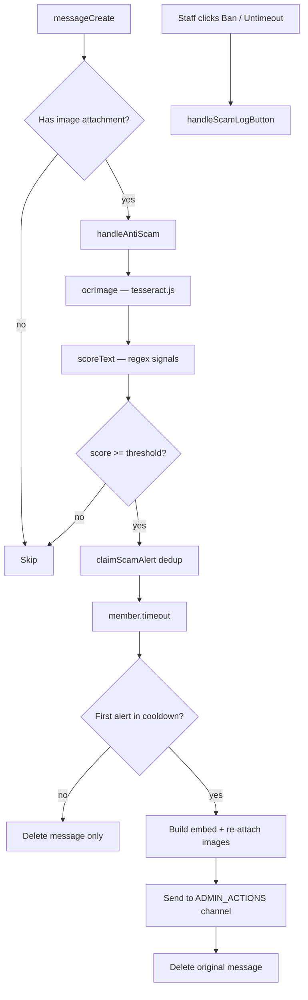

# Antiscam OCR — how it works (LitasCore / euras)

This document explains the **image-based scam detection** system used in this Discord bot. You can reuse the same architecture in another bot without re-explaining the design from scratch.

---

## Summary

When a user posts an **image attachment** in a server channel:

1. The bot downloads the image and runs **OCR** (Optical Character Recognition) with **tesseract.js**.
2. The extracted text is scored against a list of **regex signals** (fake casino / MrBeast-style scam patterns).
3. If the score meets a **threshold**, the bot:
   - gives the member a **timeout** (default 24h),
   - **deletes** the original message,
   - posts **one alert** to an admin channel with copied images + **Ban** / **Remove timeout** buttons.
4. If the user spams several scam images before timeout applies, **only one admin alert** is sent per user within a cooldown window (duplicate messages are still deleted and timed out).

No public reply is sent in the channel where the scam was posted.

---

## Architecture



---

## File layout

| File | Role |
|------|------|
| `src/events/messageCreate.js` | Calls `handleAntiScam(message)` when `message.attachments.size > 0` |
| `src/services/ocr.js` | Main orchestrator: filter attachments, OCR loop, timeout, admin embed, dedup |
| `src/antiscam/ocrImage.js` | Download image → tesseract worker → return plain text |
| `src/antiscam/scoreText.js` | Regex signal list + weighted scoring + threshold check |
| `src/services/scamLogButtons.js` | Admin channel buttons: Ban, Remove timeout |
| `src/events/interactionCreate.js` | Routes `scam:ban:…` / `scam:untimeout:…` button clicks |
| `src/utils/permissions.js` | `isStaff()` — only staff can use admin buttons |

---

## Step 1 — Hook on new messages

In `messageCreate.js`:

```js
if (message.attachments.size > 0) {
  await handleAntiScam(message);
}
```

Early exits inside `handleAntiScam`:

- `SCAM_SCAN_ENABLED=false`
- Webhook messages
- Optional channel whitelist (`SCAM_SCAN_CHANNEL_IDS` — if set, **only** those channels are scanned; if empty, **all** channels)

---

## Step 2 — Filter image attachments

Only attachments that look like static images are processed:

- MIME starts with `image/`
- **Not** `image/gif`
- Size &gt; 0

Multiple images on one message are all OCR’d; scores and reasons are merged.

---

## Step 3 — OCR (`ocrImage.js`)

**Dependency:** `tesseract.js` (v7 in this project)

```js
const { createWorker } = require('tesseract.js');
```

Process:

1. Validate MIME: `png`, `jpeg`, `jpg`, `webp` only
2. Reject files &gt; **8 MB**
3. `fetch(url)` → `Buffer`
4. Create tesseract worker with language **`eng`**
5. `worker.recognize(buffer)` → `{ data: { text } }`
6. Always `worker.terminate()` in `finally`

Returns `null` on failure (network, unsupported type, OCR error) — that attachment is skipped, others still run.

**Note:** English OCR works well on scam screenshots that use Latin text (casino UI, fake tweets, etc.). Adding more languages means passing extra langs to `createWorker` (e.g. `'eng+lit'`) at the cost of speed and bundle size.

---

## Step 4 — Scoring (`scoreText.js`)

OCR text is normalised: lowercase, collapsed whitespace.

Each **signal** is a regex + weight + human-readable label:

```js
{ pattern: /promo\s*code/i, weight: 2, label: 'Promo code mention' }
{ pattern: /withdraw\s+the\s+bonus\s+immediately/i, weight: 4, label: 'Urgency withdrawal prompt' }
// … ~25 signals total
```

For every matching signal:

- add `weight` to total **score**
- append `label` to **reasons** (max 6 shown in embed)

Trigger when:

```js
score >= SCAM_SCORE_THRESHOLD   // default: 4
```

**Tuning:**

- Lower threshold → more aggressive (more false positives)
- Higher threshold → only obvious scams
- Add new `{ pattern, weight, label }` entries for patterns you see in the wild

Example: a typical fake casino screenshot might hit promo code (+2), USDT (+1), withdrawal success (+3), urgency (+4) → score **10**, well above threshold.

---

## Step 5 — Actions on trigger

When `triggered === true`:

### 5a. Timeout

```js
await member.timeout(TIMEOUT_MS, 'Automatinis antiscam (OCR) — įtartinas paveikslas');
```

Default: `SCAM_TIMEOUT_MS=86400000` (24 hours).

Requires bot permission: **Moderate Members**. Fails silently (logged) if missing or member is above bot role.

### 5b. Alert deduplication

Problem: scammers post 3–4 images in seconds → without dedup you get 3–4 admin embeds.

Solution: in-memory map `guildId:userId → lastAlertTime`.

```js
claimScamAlert(guildId, userId)  // synchronous, called before any await after OCR
```

- Returns `true` → post admin embed
- Returns `false` → still timeout + delete message, **skip** admin post

Cooldown: `SCAM_ALERT_COOLDOWN_MS` (default **120000** = 2 minutes).

### 5c. Admin channel message

Target channel: `ADMIN_ACTIONS_CHANNEL_ID`, fallback `LOG_CHANNEL_ID`.

Embed includes:

- member mention + ID
- channel
- original message ID + link (message is deleted after)
- matched **Signalai** (reason labels)
- **Balas** (score vs threshold)

Attachments: up to **10** images re-downloaded from Discord CDN and re-uploaded to the admin channel (so staff still see them after the original is deleted).

Buttons (same row):

| Button | customId | Action |
|--------|----------|--------|
| Užbaninti | `scam:ban:{guildId}:{userId}` | Ban user |
| Nuimti timeout | `scam:untimeout:{guildId}:{userId}` | `member.timeout(null)` |

After staff clicks either button, both buttons are replaced with a **disabled grey** status label.

Only **staff** (`Administrator` or `STAFF_ROLE_IDS`) can press buttons.

### 5d. Delete original message

Requires **Manage Messages** in that channel.

---

## Environment variables

```env
# Master switch
SCAM_SCAN_ENABLED=true

# Minimum score to trigger (see scoreText.js signals)
SCAM_SCORE_THRESHOLD=4

# Timeout duration in ms (86400000 = 24h)
SCAM_TIMEOUT_MS=86400000

# One admin embed per user per N ms during spam bursts
SCAM_ALERT_COOLDOWN_MS=120000

# Optional: comma-separated channel IDs to scan ONLY those channels
# Leave empty to scan all channels
SCAM_SCAN_CHANNEL_IDS=

# Where admin alerts go (strongly recommended separate from public log)
ADMIN_ACTIONS_CHANNEL_ID=
```

---

## Discord requirements

### Intents (Developer Portal)

- **Message Content Intent** — required so the bot receives attachment metadata and can process messages in servers.

### Bot permissions

| Permission | Why |
|------------|-----|
| Moderate Members | Apply timeout |
| Manage Messages | Delete scam message in source channel |
| Send Messages, Embed Links, Attach Files | Admin alert in `#admin-actions` |
| Ban Members | Optional — for staff Ban button |

Bot role must be **above** moderated members in role hierarchy.

---

## Porting checklist (another bot)

1. `npm install tesseract.js`
2. Copy or rewrite:
   - `src/antiscam/ocrImage.js`
   - `src/antiscam/scoreText.js` (customise `SIGNALS`)
   - `src/services/ocr.js` (or merge into your moderation service)
   - `src/services/scamLogButtons.js` + button handler in `interactionCreate`
3. Call `handleAntiScam(message)` from `messageCreate` when attachments exist
4. Set env vars + `ADMIN_ACTIONS_CHANNEL_ID`
5. Enable **Message Content Intent**
6. Test with a known scam screenshot; adjust `SCAM_SCORE_THRESHOLD` and signals
7. Test spam (3 images quickly) — confirm only **one** admin embed

---

## Limitations & false positives

- OCR quality depends on image resolution, fonts, and language
- Memes or legitimate casino/giveaway discussion screenshots may score high — use threshold + staff review buttons
- GIFs are ignored (no OCR)
- Very large images (&gt; 8 MB) are skipped
- Dedup map is **in-memory** — resets on bot restart (acceptable for burst spam; optional DB persistence if needed)
- System is **reactive** (after post), not preventive — speed of timeout limits how many posts slip through

---

## Related: Discord invite link filter

This repo also has `src/services/antiInviteLinks.js` — separate from OCR, same admin channel + same Ban/Untimeout buttons. Documented only briefly here because it uses **text regex** on message content, not OCR.

---

## Quick reference — signal categories in `scoreText.js`

| Category | Examples |
|----------|----------|
| Promo / bonus codes | `promo code`, `activate code for bonus` |
| Fake giveaways | `giving away $500`, `I am giving away` |
| Fake payouts | `receive your $500 bonus`, `$500 to everyone who registers` |
| Withdrawal UI | `withdrawal successful`, `withdraw the bonus immediately` |
| Crypto / casino | `USDT`, `crypto casino`, `BTC wallet` |
| Urgency / FOMO | `this post will be deleted`, `only the fastest people` |
| Suspicious URLs | `.ru`, `.tk`, redirect instructions |

Each match adds its `weight`; sum ≥ threshold → trigger.
