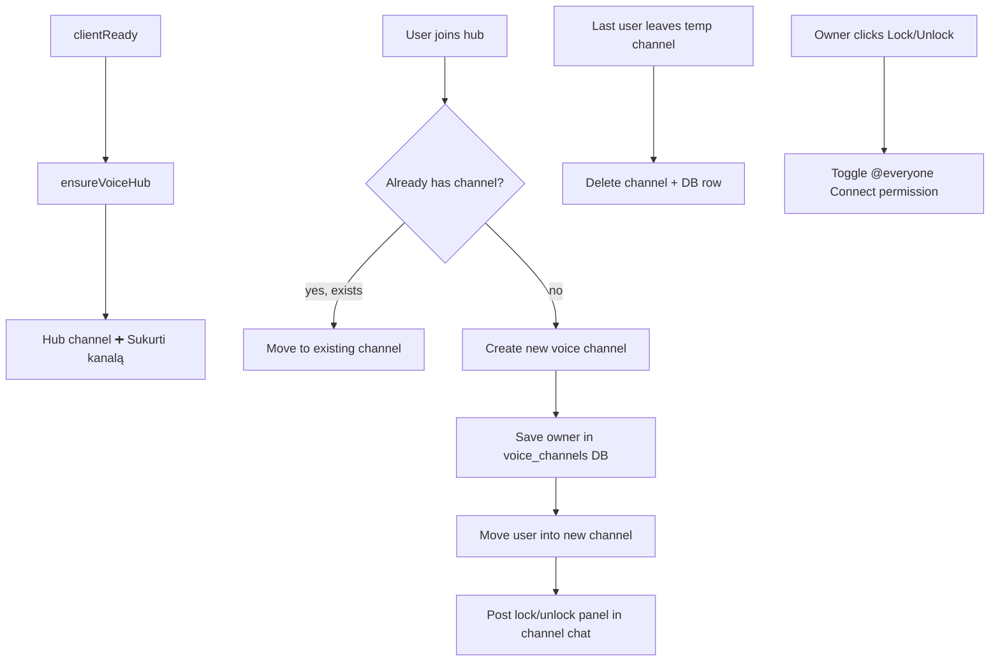

# Join-to-Create Voice Channels — how it works (LitasCore / euras)

This document explains the **“join hub → create private voice channel”** system. Share it when porting the feature to another bot.

---

## Summary

1. On bot startup, the bot ensures a **hub voice channel** exists (named `➕ Sukurti kanalą`).
2. When a user **joins the hub**, the bot:
   - creates a new voice channel for them (or moves them to their existing one),
   - moves the user into it,
   - posts a **control panel** in that channel’s text chat (lock / unlock).
3. When everyone **leaves** a user-created channel, the bot **deletes** it automatically.
4. Voice time is tracked for the **levels / XP** system in parallel.

---

## Architecture



---

## File layout

| File | Role |
|------|------|
| `src/services/voiceHub.js` | Creates hub on startup; stores hub channel ID in `bot_config` |
| `src/events/voiceStateUpdate.js` | Join hub → create/move; empty channel → delete; voice XP tracking |
| `src/services/voicePanel.js` | Embed + Lock/Unlock button UI |
| `src/events/interactionCreate.js` | Handles `vc_lock` / `vc_unlock` button clicks |
| `src/db/schema.js` | `voice_channels` table |
| `src/config.js` | `voiceCategoryId` from `VOICE_CATEGORY_ID` |
| `src/events/ready.js` | Calls `ensureVoiceHub(client)` on startup |

---

## Step 1 — Hub channel on startup (`voiceHub.js`)

When the bot becomes ready:

```js
await ensureVoiceHub(client);
```

For each guild:

1. Read stored hub ID from `bot_config` key `voice_hub_{guildId}`.
2. If that channel still exists → done.
3. Otherwise create a new **voice channel**:
   - Name: `➕ Sukurti kanalą`
   - Parent: `VOICE_CATEGORY_ID` (optional)
   - Permissions: `@everyone` can **ViewChannel** + **Connect**
4. Save the new channel ID to `bot_config`.

The hub is **persistent** — if someone deletes it manually, the bot recreates it on next restart (when stored ID is missing/invalid).

---

## Step 2 — User joins hub (`voiceStateUpdate.js`)

Listens to `voiceStateUpdate`.

When `newState.channelId === hubChannelId`:

### Already owns a channel

Query `voice_channels` for `owner_id = user.id`.

- If row exists and Discord channel still exists → **move user** to that channel (no duplicate).
- If row exists but channel was deleted → remove stale DB row, create fresh channel.

### Create new channel

```js
guild.channels.create({
  name: `${member.displayName.slice(0, 22)} vc`,
  type: GuildVoice,
  parent: voiceCategoryId,
  permissionOverwrites: [
    { id: guild.id, deny: [Connect] },           // @everyone cannot join by default
    { id: member.id, allow: [Connect, Speak, ManageChannels, MoveMembers] },
  ],
});
```

Then:

1. `INSERT INTO voice_channels (channel_id, guild_id, owner_id)`
2. `member.voice.setChannel(newChannel)`
3. `newChannel.send(buildVoicePanel(false))` — control panel in voice channel text chat

**Channel name:** server nickname (max 22 chars) + ` vc`.

**Owner permissions:** connect, speak, manage channel, move members (can rename channel, kick, etc. via Discord UI).

**Default lock state:** `@everyone` **denied Connect** — only owner (+ anyone they invite via Discord permissions) can join until unlocked.

---

## Step 3 — Auto-delete empty channels

When a user **leaves** a channel (`oldState.channelId`):

1. Look up `voice_channels` for that `channel_id`.
2. If it’s a managed temp channel and **member count is 0** → delete Discord channel + DB row.

Hub channel is never in `voice_channels`, so it is never auto-deleted.

---

## Step 4 — Lock / Unlock panel (`voicePanel.js` + buttons)

Posted once when the channel is created. Owner can refresh state by clicking the button (updates the same message).

| State | Button | customId | Effect |
|-------|--------|----------|--------|
| Open | 🔒 Užrakinti | `vc_lock` | Deny `@everyone` Connect |
| Locked | 🔓 Atrakinti | `vc_unlock` | Reset `@everyone` Connect to default (null) |

Handler in `interactionCreate.js`:

- Channel must exist in `voice_channels`.
- Only `owner_id` can use buttons.
- Updates permission overwrite on `@everyone`.
- `interaction.update(buildVoicePanel(locked))` refreshes embed + button.

**Lock** = others cannot join. **Unlock** = everyone can join (subject to category/server permissions).

---

## Database

### `voice_channels`

```sql
CREATE TABLE voice_channels (
  channel_id TEXT PRIMARY KEY,
  guild_id   TEXT NOT NULL,
  owner_id   TEXT NOT NULL
);
```

One row per active user-created voice channel.

### `bot_config`

| Key | Value |
|-----|-------|
| `voice_hub_{guildId}` | Hub voice channel snowflake ID |

---

## Environment

```env
# Optional: category where hub + temp channels are created
VOICE_CATEGORY_ID=
```

If empty, channels are created at guild root (no category).

---

## Discord requirements

### Intents

- **Guild Voice States** (required for `voiceStateUpdate`)

### Bot permissions

| Permission | Why |
|------------|-----|
| Manage Channels | Create/delete voice channels, edit overwrites |
| Move Members | Move user from hub into their new channel |
| Connect / View Channel | Bot must access voice category |
| Send Messages + Embed Links | Post control panel in voice channel text chat |

Bot role should be **above** channels it manages in hierarchy.

---

## Voice time tracking (levels)

Same `voiceStateUpdate` handler also calls:

- `trackVoiceJoin(userId, guildId)` — when joining any voice channel
- `trackVoiceLeave(member)` — when leaving or switching channels

Order matters: **leave old channel first**, then join new — so switching channels doesn’t lose minutes.

Stored in `levels.total_voice_minutes` + `voice_joined_at` (see `src/services/levels.js`).

This is separate from join-to-create logic but runs on every voice state change.

---

## User flow (example)

1. User joins `➕ Sukurti kanalą`
2. Bot creates `Kukulis Valinskas vc` and moves them in
3. Panel appears: “🔓 Kanalas atviras” with **Užrakinti** button
4. Friends join (if unlocked) or owner locks channel
5. Everyone leaves → channel disappears automatically
6. User joins hub again → bot creates a **new** channel (or reuses if old one still existed)

If user joins hub while their old channel still exists → moved back to existing channel (no second channel).

---

## Porting checklist (another bot)

1. Add `voice_channels` table + `bot_config` hub key storage
2. Implement `ensureVoiceHub()` on ready
3. Implement `voiceStateUpdate`:
   - hub join → create/move
   - empty temp channel → delete
4. Implement `buildVoicePanel()` + `vc_lock` / `vc_unlock` in `interactionCreate`
5. Set `VOICE_CATEGORY_ID` in `.env`
6. Enable **Guild Voice States** intent
7. Grant **Manage Channels** + **Move Members**
8. Test: join hub, lock, unlock, leave empty → channel gone

---

## Customisation ideas

| Change | Where |
|--------|--------|
| Hub channel name | `voiceHub.js` → `name: '➕ Sukurti kanalą'` |
| Temp channel name pattern | `voiceStateUpdate.js` → `` `${displayName} vc` `` |
| Default locked vs open | Swap `allow`/`deny` on `@everyone` in `permissionOverwrites` |
| Max channels per user | Already 1 — enforced by DB lookup before create |
| User limit on create | Add `userLimit: N` to `channels.create()` |
| Panel buttons (rename, limit, kick) | Extend `voicePanel.js` + handlers |

---

## Limitations

- **One temp channel per user** per guild (rejoin hub → same channel if still exists)
- Panel is a **single message** at creation — if deleted, owner loses buttons until recreated manually
- Hub channel ID is per-guild in DB — multi-guild bots create one hub per guild automatically
- Stale DB rows are cleaned when user rejoins hub and old channel is missing
- Lock only toggles `@everyone` Connect — role-specific overwrites are not changed

---

## Quick reference — permission model

| Who | New temp channel (default) |
|-----|----------------------------|
| @everyone | Cannot connect (locked by default) |
| Owner | Connect, Speak, ManageChannels, MoveMembers |
| After unlock | @everyone Connect = null (inherits category — usually can join) |

Hub channel:

| Who | Hub |
|-----|-----|
| @everyone | ViewChannel + Connect |
