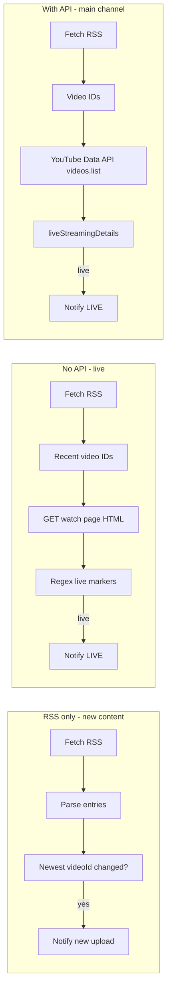

# YouTube RSS without API (guide for other bots)

This document explains how **MakenBot** uses YouTube’s public **Atom RSS feed**, how to detect **new videos** or **live streams** **without** the YouTube Data API, and what the trade-offs are.

Source reference in this repo: [`index.js`](index.js) — functions around `parseVideoEntriesFromYouTubeRSS`, `checkStreamerYouTubeLiveSession`, `checkYouTubeChannelLiveSession`.

---

## 1. The RSS feed URL

YouTube exposes a public feed for a channel (no API key):

```text
https://www.youtube.com/feeds/videos.xml?channel_id=CHANNEL_ID
```

- **`CHANNEL_ID`** must be the canonical **`UC…`** id (24 characters, starts with `UC`), not `@handle`.
- Example: `https://www.youtube.com/feeds/videos.xml?channel_id=UCxxxxxxxxxxxxxxxxxxxxxx`

Alternative (user id, less common for bots):

```text
https://www.youtube.com/feeds/videos.xml?user=USERNAME
```

For a **playlist**:

```text
https://www.youtube.com/feeds/videos.xml?playlist_id=PLxxxx
```

### How to find `UC…` channel id

1. YouTube Studio → Settings → Channel → **Advanced settings** → Channel ID  
2. Or channel page → **About** → “Share channel” / channel ID  
3. MakenBot also documents this for `/streamer add` (must be `UC` + 24 chars).

If the id is wrong, the feed often returns **HTTP 404** (see troubleshooting below).

---

## 2. What RSS gives you (and what it does not)

| RSS provides | RSS does **not** provide |
|--------------|---------------------------|
| Latest entries (typically up to **~15** recent uploads) | Guaranteed “this is live right now” flag |
| `videoId`, title, link, published time (in XML) | Full channel history |
| Free, no quota, no Google Cloud project | Reliable VOD vs live distinction by itself |

**Important:** When a channel goes **live**, YouTube usually adds/updates an entry in this feed, but the feed is oriented toward **uploads**. For **live-only** alerts you need an extra step (API or HTML check — see below).

For **“new video posted”** bots, RSS alone is often enough: poll the feed, compare the newest `videoId` to what you stored last time, notify on change.

---

## 3. How MakenBot fetches RSS

HTTP client config (avoid empty User-Agent; ask for XML):

```javascript
const youtubeRssAxiosConfig = {
    timeout: 15000,
    headers: {
        'User-Agent':
            'Mozilla/5.0 (Windows NT 10.0; Win64; x64) AppleWebKit/537.36 (KHTML, like Gecko) Chrome/122.0.0.0 Safari/537.36',
        Accept: 'application/atom+xml,application/xml,text/xml;q=0.9,*/*;q=0.8'
    }
};

const rssUrl = `https://www.youtube.com/feeds/videos.xml?channel_id=${channelId}`;
const response = await axios.get(rssUrl, youtubeRssAxiosConfig);
const xmlData = response.data; // string
```

Node 18+ can use `fetch` instead of `axios` with the same headers.

---

## 4. Parsing the feed (no XML library required)

MakenBot uses regex on the Atom XML (works for typical YouTube feeds; fragile if Google changes structure).

### 4.1 Channel title (optional)

Take text before the first `<entry>`:

```javascript
function parseChannelTitleFromYouTubeRSSFeed(xmlData) {
    const beforeEntry = xmlData.split('<entry>')[0] || xmlData;
    const m = beforeEntry.match(/<title>([^<]+)<\/title>/);
    return m ? m[1].trim() : 'Channel';
}
```

### 4.2 Video entries

For each `<entry>…</entry>` block, extract:

| Field | Where in XML |
|-------|----------------|
| **videoId** | `<yt:videoId>…</yt:videoId>`, or `<id>yt:video:…</id>`, or `watch?v=` in link |
| **title** | `<title>` plain or `<![CDATA[…]]>` |
| **url** | `<link rel="alternate" href="https://www.youtube.com/watch?v=…">` |

Implementation (simplified from `parseVideoEntriesFromYouTubeRSS`):

```javascript
function parseVideoEntriesFromYouTubeRSS(xmlData, maxEntries = 5) {
    const results = [];
    const entryRegex = /<entry>([\s\S]*?)<\/entry>/g;
    let m;
    while ((m = entryRegex.exec(xmlData)) !== null && results.length < maxEntries) {
        const entry = m[1];
        let videoId =
            (entry.match(/<yt:videoId>([^<]+)<\/yt:videoId>/) ||
                entry.match(/<(?:[\w:]*:)?videoId>([^<]+)<\/(?:[\w:]*:)?videoId>/))?.[1] ||
            (entry.match(/<id>yt:video:([^<]+)<\/id>/) ||
                entry.match(/<id>https?:\/\/www\.youtube\.com\/watch\?v=([^<]+)<\/id>/))?.[1];
        if (!videoId) {
            const fromWatch = entry.match(/watch\?v=([A-Za-z0-9_-]{11})/);
            if (fromWatch) videoId = fromWatch[1];
        }
        if (!videoId) continue;

        const linkMatch =
            entry.match(/<link[^>]*rel="alternate"[^>]*href="([^"]+)"/) ||
            entry.match(/<link[^>]*href="([^"]+)"[^>]*rel="alternate"/) ||
            entry.match(/href="(https:\/\/www\.youtube\.com\/watch\?v=[^"]+)"/);
        const url = linkMatch?.[1] || `https://www.youtube.com/watch?v=${videoId}`;

        let title = 'Video';
        const cdata = entry.match(/<title><!\[CDATA\[([\s\S]*?)\]\]><\/title>/);
        const plain = entry.match(/<title>([^<]+)<\/title>/);
        if (cdata) title = cdata[1].trim();
        else if (plain) title = plain[1].trim();

        results.push({ videoId, url, title });
    }
    return results;
}
```

YouTube video IDs are **11 characters** (`[A-Za-z0-9_-]{11}`).

Thumbnail without API:

```text
https://i.ytimg.com/vi/VIDEO_ID/hqdefault.jpg
```

---

## 5. Two strategies in MakenBot



### 5.1 New content only (no API) — recommended for another bot

**Algorithm:**

1. Poll RSS every **N minutes** (MakenBot uses **2 minutes** for live checks; for uploads **5–15 min** is often enough).
2. Parse entries; take **`entries[0].videoId`** (newest first in feed).
3. Keep `lastSeenVideoId` in memory, file, or DB.
4. If `videoId !== lastSeenVideoId` and it’s not the first run → **new content** → send Discord/Telegram/etc. notification.
5. Update `lastSeenVideoId`.

**First run:** set `lastSeenVideoId` without notifying (avoid spam on bot restart).

```javascript
const seen = new Map(); // channelId -> lastVideoId

async function checkNewUpload(channelId) {
    const rssUrl = `https://www.youtube.com/feeds/videos.xml?channel_id=${channelId}`;
    const res = await fetch(rssUrl, { headers: { 'User-Agent': 'YourBot/1.0', Accept: 'application/atom+xml' } });
    if (!res.ok) throw new Error(`RSS ${res.status}`);
    const xml = await res.text();
    const entries = parseVideoEntriesFromYouTubeRSS(xml, 1);
    if (!entries.length) return null;

    const { videoId, title, url } = entries[0];
    const prev = seen.get(channelId);

    if (prev === undefined) {
        seen.set(channelId, videoId);
        return null; // baseline, no alert
    }
    if (prev === videoId) return null;

    seen.set(channelId, videoId);
    return { videoId, title, url }; // notify
}
```

This detects **new items appearing in the feed** (uploads, and often **premieres / live VOD entries**). It does **not** distinguish “live” vs “normal upload” unless you add step 5.2.

### 5.2 Live detection without API (MakenBot streamers)

Used in `checkStreamerYouTubeLiveSession`:

1. RSS → up to **5** recent `videoId`s (candidates).
2. For each candidate, `GET https://www.youtube.com/watch?v=VIDEO_ID` with browser-like headers.
3. Scan HTML for live markers (YouTube embeds JSON in page):

```javascript
function isVideoLiveFromWatchPageHtml(html) {
    if (!html || typeof html !== 'string') return false;
    if (/\"isLiveBroadcast\":\s*true/.test(html)) return true;
    if (/\"liveBroadcastContent\":\s*\"live\"/.test(html)) return true;
    if (/\"isLive\":\s*true/.test(html) && /liveStreamingDetails|liveBroadcastDetails/.test(html)) return true;
    return false;
}
```

4. First matching video → treat as **currently live**; notify once per `videoId` (dedupe).

**Watch page request headers** (from MakenBot):

```javascript
const youtubeWatchPageAxiosConfig = {
    timeout: 15000,
    headers: {
        'User-Agent':
            'Mozilla/5.0 (Windows NT 10.0; Win64; x64) AppleWebKit/537.36 (KHTML, like Gecko) Chrome/122.0.0.0 Safari/537.36',
        Accept: 'text/html,application/xhtml+xml;q=0.9,*/*;q=0.8',
        'Accept-Language': 'en-US,en;q=0.9'
    }
};
```

**Caveats:**

- YouTube can change HTML/JSON shape → regex breaks until updated.
- Rate limits / bot detection if you poll too aggressively.
- Not officially supported; use polite intervals and caching.

### 5.3 Live detection with API (MakenBot main channel)

`checkYouTubeChannelLiveSession`:

1. RSS → up to **10** entries → collect video IDs.
2. `GET https://www.googleapis.com/youtube/v3/videos?id=…&part=snippet,liveStreamingDetails&key=API_KEY`
3. `snippet.liveBroadcastContent === 'live'` or `liveStreamingDetails.actualStartTime` without `actualEndTime`.

More reliable for live, but requires **API key + quota**.

---

## 6. Deduplication (avoid spam)

MakenBot keeps an in-memory `Set`:

```javascript
const notifiedVideoIds = new Set();
const notificationKey = `main_${videoInfo.videoId}`; // or streamer_discordId_videoId

if (!notifiedVideoIds.has(notificationKey)) {
    // send notification
    notifiedVideoIds.add(notificationKey);
}
```

For production, persist `last_video_id` per channel (MakenBot’s `youtube_streamers.last_video_id` in SQLite).

---

## 7. Polling schedule (MakenBot)

On bot `ready`:

- Wait **10 seconds**
- Run check once
- Then **`setInterval(..., 2 * 60 * 1000)`** — every **2 minutes**

For a **upload-only** bot, **5–15 minutes** is usually fine and lighter on YouTube.

---

## 8. Minimal “another bot” checklist (no API)

1. Store **`UC…` channel id** per monitored channel.
2. **`fetch` RSS** with User-Agent + Accept XML.
3. **Parse** `<entry>` blocks → `videoId`, `title`, `url`.
4. **Compare** newest `videoId` to stored value → notify on change.
5. (Optional) For **live**, fetch watch page and run **`isVideoLiveFromWatchPageHtml`** on top candidates.
6. **Dedupe** by `videoId` in DB/file.
7. Handle **404** → wrong channel id or deleted channel.
8. On bot restart, **baseline** without notifying.

---

## 9. Troubleshooting

| Symptom | Likely cause |
|---------|----------------|
| RSS **404** | Wrong `channel_id`, typo, or channel removed |
| No new entries | Channel inactive; or feed delay (minutes) |
| Live never detected (no API) | HTML markers changed; or live not in top N RSS entries |
| Duplicate notifications | Missing dedupe; or RSS reordered same videos |
| `Request failed with status code 500` | YouTube transient error — retry with backoff |

MakenBot logs RSS 404 once as a warning when `YOUTUBE_CHANNEL_ID` is invalid (see `youtubeRssNotFoundMainLogged`).

---

## 10. Legal / policy note

- Public RSS and watch pages are used by many bots, but YouTube **Terms of Service** and automated access rules apply.
- Prefer **reasonable poll intervals**, identify your bot via User-Agent, and avoid heavy scraping.
- For commercial or high-volume use, **YouTube Data API** is the supported path.

---

## 11. Quick reference — MakenBot functions

| Function | API key? | Purpose |
|----------|----------|---------|
| `parseVideoEntriesFromYouTubeRSS` | No | Parse Atom XML |
| `checkStreamerYouTubeLiveSession` | No | RSS + watch page → live |
| `checkYouTubeChannelLiveSession` | Yes | RSS + `videos.list` → live |
| `checkMainYouTubeChannel` | Yes (if configured) | Main channel live alerts |
| `checkAllYouTubeStreams` | No | Per-streamer live via RSS+HTML |

For **another bot with no API access**, copy the pattern from **`checkStreamerYouTubeLiveSession`** (live) or the **§5.1** loop (new uploads only).
